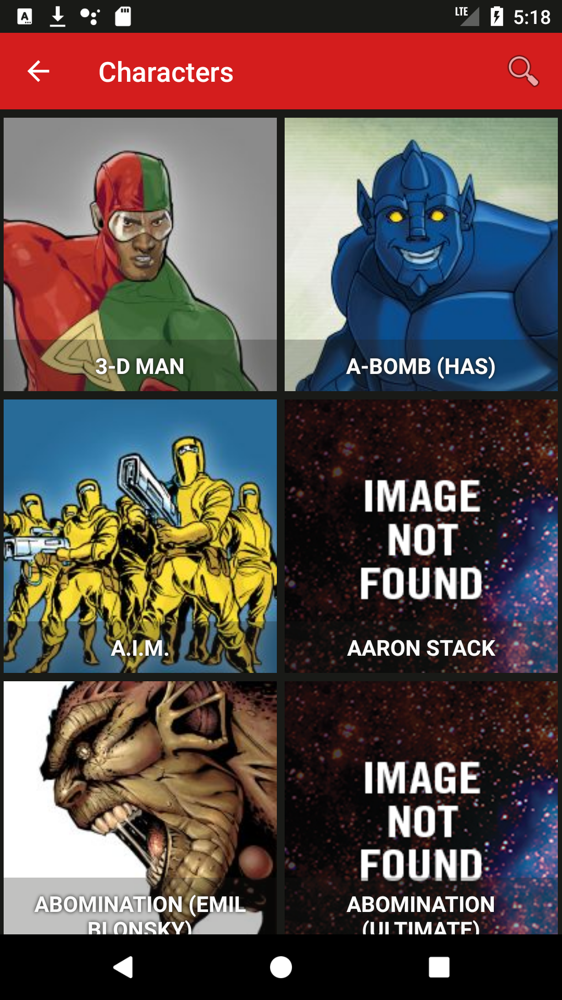
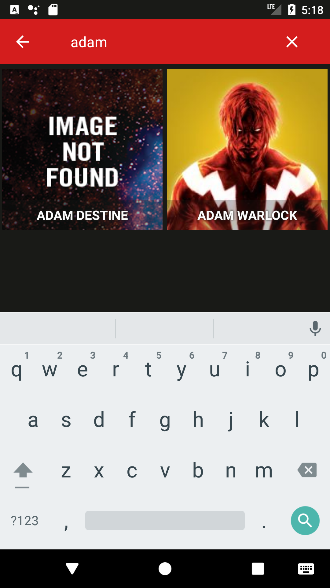
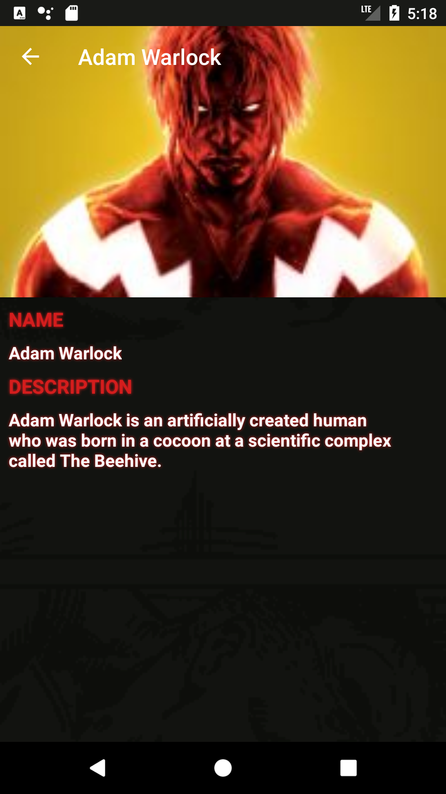

# MarvelFanApp
An App that consumes MARVEL public API. The Marvel Comics API allows developers everywhere to access information about Marvel's vast library of comics—from what's coming up, to 70 years ago. This repository has been created with the purpose to learn Git, Android, java and others tools

------

## Screenshot

  
  
  
  
  
  

------

## Features
- List of all MARVEL characters 
- Name based search
- Details the selected character
- Menu with different links

------

## Development Tools
- Android Studio v3.1.3
- Android SDK Build Tools v27.0.3
- MinSdkVersion 15
- CompileSDKVersion 27
- gradle-v4.4

------

## Dependencies
- Android Support Tools (design,recyclerView, cardView,appcompat-v7) v27.1.1
- ConstraintLayout 1.1.2
- Glide v4.7.1
- Retrofit v2.1.0
- Converter-gson v2.1.0
- jUnit v4.12
- Android Support Test v1.0.2
- Espresso v3.0.2

------
